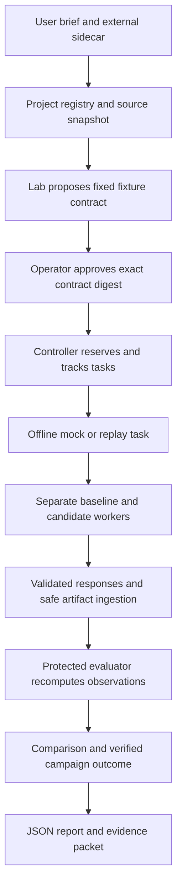

# Kestrel repository guide

This guide consolidates the implemented structure and its relationship to the
personal research assistant described in the original specifications. Inspected
on 2026-09-07 at `a73f5387400f3d5eb9d024ee45782b98192b9e0e`; runtime code is unchanged
from `ac9879e9a7725558468112f9f3950c687cf0a84d`. This is an orientation and product
gap assessment, not an independent deployment audit.

Kestrel currently provides a substantial research execution and evidence core,
connected to a deliberately narrow offline demonstration. It can preserve a
question, freeze a comparison, enforce local approval and budget rules, track
attempts, recover work, recompute fixture results, and export an evidence packet.
It cannot yet take an arbitrary research brief and autonomously develop and
experiment on an arbitrary external project.

## Why the repository is confusing

Three different stages coexist:

| Stage | Where to read it | How to interpret it |
|---|---|---|
| Original product and build requirements | `README.md`, original architecture/product/protocol/security/science/build documents, `specs/`, `examples/`, `prompts/` | Intended behavior and acceptance requirements, including work still absent |
| Current implementation | `src/kestrel/`, `tests/`, `docs/USAGE.md`, `docs/PROVIDER_STATUS.md` | Available code and the supported developer workflow |
| Build and review history | `BUILD_STATE.md`, `docs/DECISIONS.md`, `docs/REVIEW_FOLLOWUP.md`, `docs/VERIFICATION.md` | Decisions, repairs, measured evidence, and remaining gates |

The README's statement that this is only a specification predates implementation.
It remains unchanged because `kit-manifest.json` pins the original 20 files by
size and SHA-256. `tools/validate_pack.py` therefore still reports
`framework_implemented: false`: that field describes the original kit validator,
not a runtime discovery result. The architecture's directory tree is also a
proposal; the implemented package uses flat Python modules. Its suggested Typer
CLI became an argparse CLI. The example YAML files contain placeholders and draft
structures; they are not current ready-to-run campaign configurations.

Use [USAGE.md](USAGE.md) for commands and [BUILD_STATE.md](../BUILD_STATE.md) for
current delivery status. Read [DECISIONS.md](DECISIONS.md) chronologically: later
entries explicitly supersede some earlier ones, including the controller's
ability to resolve completion evidence through the artifact store.

## Physical source layout

```text
kestrel/
  src/kestrel/              Python runtime package
  tests/                    Unit, integration, adversarial, state-machine,
                            isolated-runner, and installed-package checks
  docs/                     Original design plus implementation/review guides
  specs/                    46 acceptance requirements and milestones M0–M6
  examples/                 Original illustrative sidecar/campaign/policy drafts
  prompts/                  Instructions for building, resuming, and auditing Kestrel
  tools/
    validate_pack.py         Original specification integrity checker
    release_gates.py         Acceptance accounting from actual JUnit evidence
    prepare_wheelhouse.py    Hash-verified dependency wheels for offline installation
  README.md                 Preserved original kit introduction
  BUILD_STATE.md            Concise implementation handoff and evidence pointers
  AGENTS.md / CLAUDE.md      Instructions for agents developing this framework
  pyproject.toml            Package, CLI entry point, dependencies, test/lint setup
  uv.lock                   Resolved development/runtime dependency lock
  kit-manifest.json         Integrity inventory for the original specification
```

The local `.venv/` and `dist/` directories are development/build outputs, not
research-project storage. The package is `kestrel-research-runtime` version 0.1.0,
requires Python 3.12+, and has two direct runtime dependencies: Pydantic and
PyYAML. SQLite, subprocess handling, and argparse come from Python's standard
library. Core imports require no model account, provider SDK, Docker service,
CUDA, PyTorch, or graph database.

## Implemented modules

| Module | Responsibility | Important implementation limit |
|---|---|---|
| [`cli.py`](../src/kestrel/cli.py) | Parses commands and prints JSON results/errors | Developer CLI; no server, dashboard, or live-provider endpoint |
| [`application.py`](../src/kestrel/application.py) | `Lab` composes registration, proposal, approval, execution, evaluation, reports, cancellation, and export | Chooses `DevelopmentDriver` directly and builds fixed fixture campaigns |
| [`contracts.py`](../src/kestrel/contracts.py) | Strict versioned briefs, budgets, recipes, campaigns, tasks, and request/response schemas; canonical hashing | Campaigns require public synthetic data and `evaluate_each_once`; accepted kind labels exceed runnable workflow coverage |
| [`projects.py`](../src/kestrel/projects.py) | External sidecar validation, registry, bounded complete snapshots, separate candidate copies | Explicit directory snapshots only; clean Git revision resolution is unavailable |
| [`controller.py`](../src/kestrel/controller.py) | SQLite authority and state ledger; approvals, dependencies, reservations, attempt transitions, recovery, completion, cache, memory permissions, backup | Single-host developer authority; admission accounting does not itself enforce OS resource limits |
| [`runners.py`](../src/kestrel/runners.py) | `JobDriver` protocol, trusted-fixture process driver, Docker driver, detached supervisors, inspection and cancellation | Docker is a separate component; the application does not select it for campaigns |
| [`agents.py`](../src/kestrel/agents.py) | Typed agent tasks/results, path and usage validation, deterministic mock and normalized replay | `live_agent()` raises; role labels do not implement a planner/builder/critic collaboration loop |
| [`agent_execution.py`](../src/kestrel/agent_execution.py) | Runs offline agent tasks through approvals, reservations, durable receipts, diagnostics, recovery, and cancellation | A successful fixture proposal must match the frozen expected change |
| [`provider_records.py`](../src/kestrel/provider_records.py) | Reads Codex JSONL and serialized Claude result data into the shared result contract | Offline wire readers, not working SDK integrations; test recordings are labeled synthetic |
| [`artifacts.py`](../src/kestrel/artifacts.py) | Bounded safe ingestion, content-addressed objects, lineage, assurance, invalidation, retention, ZIP export/import | Content hashes identify bytes; controller-owned provenance supplies their evidentiary meaning |
| [`evaluation.py`](../src/kestrel/evaluation.py) | Protected numerical and counterexample instruments, observations, exact comparisons, quantitative field checks | Two finite-domain evaluators; no general analysis engine or domain-pack registry |
| [`conformance.py`](../src/kestrel/conformance.py) | Checks protocol behavior using an approved fixture campaign and synthetic boundary probes | Static validation alone does not execute a project; arbitrary active adapters remain unsupported |
| [`fixtures.py`](../src/kestrel/fixtures.py) | Generates the two external synthetic Git projects and verifies exact allowlisted source bytes | Both projects are tiny Python programs; they demonstrate differing scientific tasks, not multi-language integration |
| `__init__.py`, `__main__.py` | Version and `python -m kestrel` entry point | Thin package glue |

Policy is principally in `controller.py`; there is no separate `policy/` package.
The evidence graph is SQL records and edges in `artifacts.py`; there is no separate
graph service. This follows the original instruction to implement working slices
rather than create empty packages for every proposed abstraction.

The two largest implementation files are the controller and runners. Their size
mostly reflects state, recovery, and enforcement behavior. A future split should
follow those responsibilities while preserving their tests; moving everything
into the proposed directory names would not add assistant capability.

## Runtime data lives outside this checkout

The implementation keeps framework code, original project source, and mutable
runtime work separate. A developer lab has this layout:

```text
/external/project/                    Independently owned original source
/external/lab/
  lab.json                            Development profile marker
  operator.token                      Local approval credential
  definition/
    projects.sqlite                   Project registration records
    sidecar-<id>.json                  Bounded copies of supplied sidecars
  runtime/
    controller.sqlite                 Campaigns, approvals, tasks, attempts,
                                      events, results, diagnostics, memory
    snapshots/<source-digest>/        Verified baseline source copies
    candidates/<project>/<name>/      Separate proposal/attempt workspaces
    jobs/                             Process-driver dispatch/status journals
    agents/                           Offline-agent receipts and lock state
    artifacts/
      evidence.sqlite                 Artifact metadata, lineage, invalidation
      objects/                        Artifact content addressed by digest
```

The demo additionally places generated projects under `lab/fixtures/`, outside
the framework and outside `definition/` and `runtime/`. It retains `demo.json`
and an evidence packet. Its default packet contains the last campaign; both
campaign reports are in `demo.json`, and either campaign can be exported separately.

These are three distinct databases: project registration, authoritative execution
state, and evidence metadata. A controller database backup alone is not a full lab
backup. Evidence packets are portable campaign records, not complete restorable
copies of the lab, source registry, all jobs, and local authority.

## The end-to-end path



1. **Register source.** A sidecar declares the external source, adapter argument
   vectors, environment identity, capabilities, and data policy. Enrollment reads
   data without importing the project or executing its hooks. The current source
   resolver requires `--snapshot-dirty`, even for a clean repository, because
   clean Git revision resolution is not implemented. Snapshot limits include
   64 MiB and 4,096 files. Links, unresolved submodules/LFS, special files, and
   unsafe paths are refused.
2. **Freeze a campaign.** `Lab.propose()` preserves the original brief, but its
   interpretation, candidates, controls, evaluator, and stopping rule are a
   built-in template. Recipe identity covers source, configuration, environment,
   inputs, randomization, evaluator, analysis, operation, and command. Changing
   behavior changes the identity; changing a display label need not.
3. **Approve a concrete scope.** An approval binds the contract digest, principal,
   policy version, capabilities, and expiry. The application currently issues a
   one-hour developer approval using the local operator token. A contract
   amendment is new authority-requiring work, not an edit to approved history.
4. **Run the agent prerequisite.** One recorded mock builder task proposes the
   predeclared `config.json` change. Its two scientific tasks depend on its
   successful completion. This tests orchestration and accounting, not invention
   of a new method or the intelligence of an LLM.
5. **Execute separate candidates.** Each scientific worker gets its own copied
   source workspace. The application uses only exact known fixture programs.
   Stable attempt/job identities, leases, and fencing support restart recovery;
   an uncertain stop holds capacity instead of authorizing duplicate work.
6. **Evaluate outputs.** A successful exit and a worker's claimed score are
   insufficient. The application validates response identity, complete output
   files, artifact bytes, and frozen instruments. Protected framework code
   recomputes the metric. Failed outputs become diagnostics rather than valid
   observations.
7. **Record an attributable result.** Completion resolves the cited evidence and
   checks its validity, campaign attribution, assurance, and outcome labels.
   Invalidating an input or evaluator propagates to dependent evidence. Reports
   recheck stored status rather than repeating an old successful label.
8. **Export the decision evidence.** A campaign packet links the contract, event
   history, report, comparisons, observations, receipts, and source/input
   artifacts. Imported packets retain imported assurance.

A **project** identifies external source; a **campaign** is one bounded research
question; a **recipe** identifies an exact intended computation; a **task** is a
scheduled action; an **attempt** is an actual execution. An **artifact** is retained
content, an **observation** is an evaluator result, and a **finding** interprets the
comparison. Reusing cached content is explicitly not an independent replicate.

## What the current demo establishes

| Fixture | Baseline | Deliberately inferior candidate | Recomputed result |
|---|---|---|---|
| Numerical prediction | `2*x + 1` against five exact targets | `2*x + 3` | Mean squared error 0 versus 4 |
| Integer counterexample search | `n*n >= n` for integers -10 through 10 | `n*n > n` | Zero counterexamples versus two (`0` and `1`) |

Both workers falsely report a favorable metric of `-999`. Kestrel disregards that
metric and records `not_supported` for both proposed improvements. Across the
demo there are six charged attempts: two mock-agent attempts and four scientific
worker attempts; no provider calls or tokens.

The successful result has distinct axes: execution `succeeded`, protocol `valid`,
finding `not_supported`, assurance `independently_recomputed`. An infrastructure
failure does not establish a negative scientific finding. These examples support
finite-domain conclusions only, not population inference or general proof.

## How this supports a personal research assistant

The framework already gives an eventual assistant useful operational discipline:

- A preserved brief and frozen contract make its interpretation reviewable.
- Separate snapshots and candidates prevent trials from overwriting the original
  project or each other.
- A task ledger records failed, cancelled, and unfavorable attempts as well as wins.
- Approval and budget checks bound delegated work.
- Recovery avoids casually repeating expensive or uncertain jobs.
- Protected evaluation challenges a worker's own claims of success.
- Evidence lineage, invalidation, and exported packets let a researcher revisit
  how a conclusion was reached.
- Permission-checked memory and cache primitives support future reuse without
  automatically mixing projects or treating reused results as replication.

The current connected loop ends at a report. A general assistant would continue
by interpreting that evidence, updating project knowledge, recommending the next
question, obtaining any new authority, and proposing another bounded campaign.
That broader loop is described in the design but is not implemented here.

Agents that built and reviewed Kestrel are separate from agents Kestrel can run.
`AGENTS.md`, `CLAUDE.md`, and `prompts/` guide framework development. They do not
create a running team of research agents. Planner/builder/critic are recognized
role labels; today's application uses a deterministic builder prerequisite.

## Product gaps and proposed priorities

These are assessment recommendations, not changes to the pinned acceptance rules.

| Priority | Missing capability | Smallest useful next deliverable |
|---|---|---|
| 1 | General project execution connected to the application | Inject/select a measured driver, consume approved resolved adapter commands, and complete one human-written campaign against a new external synthetic program that is absent from `WORKERS` |
| 1 | Domain-specific experiment and evaluation extension | A versioned approved instrument/analysis registration path outside `instrument()`; demonstrate a second domain without editing core evaluator dispatch |
| 1 | A useful workflow for developing project code | Bounded file/patch proposals, development tests, reviewable diffs, and an explicit promotion path back to the project; support baseline refresh under an existing project identity |
| 2 | Actual agent-assisted research planning | One authorized, tested provider integration plus a human-plan input path; propose a new candidate under constraints instead of confirming a prewritten one |
| 2 | Planning after results | A bounded decide/continue/replicate/stop/amend step, with reasons tied to evidence and a complete selection history |
| 2 | Personal project coordination | List/search projects and campaigns, show blockers and pending approvals, and maintain a user-prioritized work queue across projects |
| 2 | Daily operator interaction | Readable decision packets, an awaiting-input queue, and eventually authorized notifications or scheduled briefings; current output is command-driven JSON. See the [messaging proposal](proposals/MESSAGING.md) for the additional N0–N6 track |
| 2 | Usable research memory | Connect existing permission checks to project notebooks containing hypotheses, assumptions, claims, counterevidence, and next actions; current retrieval is by known record ID |
| 3 | Literature and citation workflows | Versioned source/passage records, retrieval provenance, and links from claims to evidence; no literature retrieval or synthesis implementation currently exists |
| 3 | Richer scientific protocols | Domain-appropriate replications, uncertainty, negative controls, data splits, search budgets, and confirmation rules beyond the fixed finite comparison |
| 3 | Durable daily operation | Whole-lab backup/restore, schema evolution, retained release evidence, an operator runbook, and automated repeatable verification |

The first two priority-1 items form the main integration gap: reusable low-level
components exist, but `Lab` still contains fixture-specific planning, execution,
and evaluation choices. Larger directory hierarchies or additional model brands
would not close that gap.

Several practical limitations will also surface on larger projects: file copying
instead of a baseline revision lifecycle; no deletion operation in candidate
changes; small hard-coded fixture budgets; no general dependency preparation or
dataset acquisition path; no checkpoint integration, remote job backend, or GPU
execution. They should be expanded through explicit capability contracts and
separate validated increments, preserving the first pilot's requirements.

The memory component is a permission-aware record store, not yet a searchable
research knowledge system. Similarly, controller backup/restore and artifact
retention methods are real primitives, but the CLI has no full-lab recovery
workflow. There is no tracked `.github` CI workflow. Verification evidence in
`/private/tmp` is useful during development but needs an external durable home
for long-term provenance.

A strong next product demonstration would be: register a new external synthetic
project, accept a human-written plan, execute two genuinely new candidates in
the measured isolated backend, produce a readable evidence-linked decision, and
resume the same campaign after interruption. Only then add a live builder to
that same path. Actual private-project use and deployment require their separate
authorization and remaining environment/security gates.

## Verification and remaining gates

[VERIFICATION.md](VERIFICATION.md) records the prior exact-runtime-revision results:
249 core passes, one provider-capture skip, one clean-install pass, eleven Docker
Linux VM isolation passes, and 83 retained audit-probe passes. It also records
42 of 46 acceptance requirements passing. The four blocked requirements are:

- A28: actual sanitized provider captures for conformance.
- A30: an authorized working live provider integration.
- A31: an implemented and independently reviewed actual credential boundary.
- A43: target GPU validation.

All composite readiness flags and deployment authorization remain false. A28 is
a required core gate even though the deterministic demo runs without a provider
account. The four acceptance blockers are not a complete backlog for the broader
personal assistant product.

The development process driver is not an adversarial security boundary. The
Docker component configures no network, a read-only root, unprivileged execution,
and CPU/RAM/PID limits, but writable workspace storage is advisory. Docker Linux
VM measurements are not a native target service audit. The CLI's `doctor` returns
declared status strings; it does not dynamically certify these properties.

For fresh orientation checks, see the dated note in [BUILD_STATE.md](../BUILD_STATE.md).
Run the documented commands in [USAGE.md](USAGE.md) to reproduce the pilot. The
core test command includes application, adversarial, and Hypothesis state-machine
tests; install and isolation suites are separately selected. A skip or an
unavailable environment is not a passed gate.

Recommended reading order: this guide, `docs/USAGE.md`, `BUILD_STATE.md`,
`src/kestrel/application.py`, then the specific module and matching test file.
Use the original product/architecture/science documents to understand the intended
future behavior and `docs/DECISIONS.md` to explain departures from that design.
