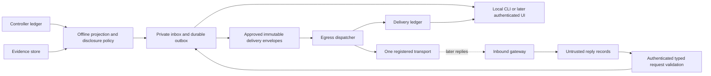

# Proposal: messaging and the personal research assistant

**Implementation status, 2026-09-07.** The N0-N4 subset covered by the Telegram
plan is implemented offline on `build/telegram-messaging`; N5 remote approval and
N6 literature remain unimplemented and unauthorized. See
[MESSAGING_VERIFICATION.md](../MESSAGING_VERIFICATION.md) for what is verified and
what is explicitly unpassed. The proposal status below is the historical record of
when this document was written.

**Status: consolidated design proposal, 2026-09-07.** This incorporates Claude's
initial draft and a review of the implemented runtime and official transport
documentation. All new records, commands, defaults, and N0–N6 increments below are
proposed. No messaging implementation, service setup, delivery, live model call,
or new permission is enabled. The original specification, acceptance requirements,
and integrity-pinned examples remain unchanged.

**Channel selected:** the operator chose Telegram. The concrete next design is
[TELEGRAM_IMPLEMENTATION_PLAN.md](TELEGRAM_IMPLEMENTATION_PLAN.md), which defines
the implementation sequence, private-chat enrollment, API behavior, deployment
gates, and limited replies. The operator requested planning only; implementation
and service setup have not started. Transport comparisons below remain background.

## 1. Recommended direction

Build a **persistent assistant inbox with proactive delivery**, backed by Kestrel's
recorded execution and evidence. Start with a deterministic daily brief, a queue
of decisions awaiting the operator, and subscriptions to meaningful milestones.
Add one phone transport after the local workflow works. Add conversational replies
and literature monitoring later, without making remote approval a prerequisite.

The assistant should reliably answer four questions:

1. What changed since I last checked?
2. What needs my attention, why now, and what happens if I wait?
3. What can continue inside the existing authorization?
4. What is the most useful next decision, and what evidence supports it?

Messaging is useful even before Kestrel can autonomously conduct general research.
It does not itself supply the missing planner, general isolated campaign execution,
or live-provider integration. Those remain separate work tracks described in the
[repository guide](../REPOSITORY_GUIDE.md).

The defining assistant behavior is **follow-through**: remember an unresolved
question, recognize its resolution, update the plan, and stop reminding the user.
A stream of job-completion messages does not provide that behavior.

## 2. Behaviors worth building

### 2.1 A prioritized idea bank

| Behavior | Useful message or interaction | Priority and dependency |
|---|---|---|
| Morning brief | What changed overnight, what is running, decisions needed, next proposed action | First slice; deterministic records suffice |
| Awaiting-you queue | One question with context, options, a recommendation, and the consequence of waiting | First slice for existing approval/blocker records; typed planner questions later |
| Milestone subscriptions | “Tell me when this run ends,” “when this experiment has a verified result,” or “when this project's replication gate passes” | Early; explicit scopes and predicates |
| Recovery assistant | “Execution is uncertain; capacity remains reserved. Reconciliation is required before a retry.” | Early for recorded states; no diagnosis beyond evidence |
| Evidence correction | “The result in yesterday's brief now depends on an invalidated evaluator.” | Early; link the earlier message and affected evidence |
| Resume packet | “You last looked Tuesday. Here are the changes, unresolved decisions, and the exact point to resume.” | Early; explicit user review cursor, not assumed reading |
| Reminders and watch conditions | “Tomorrow morning, remind me if confirmation is still blocked.” | After durable schedules and preferences |
| Resource steward | Budget thresholds; idle capacity while eligible work is blocked; estimated completion or cost with uncertainty | Ledger facts early; host telemetry and forecasting later |
| Weekly research memo | Question → evidence gained → remaining uncertainty → next discriminating experiment | Deterministic outline first; richer interpretation later |
| Project continuity | Remember why an approach was rejected and surface it when a similar proposal recurs | Later; permission-scoped decision memory |
| Research planning partner | Offer bounded next experiments with expected information gained, cost, and stopping criteria | Later planner integration; proposals retain their uncertainty |
| Literature scout | A small shortlist of papers bearing on active questions, with passages and a proposed follow-up | N6; independent retrieval and reasoning permissions |
| Meeting/deadline preparation | Assemble a progress note or submission checklist from explicit project milestones | Later; operator-entered dates first, calendar access separately authorized |
| Reproducibility steward | Flag a missing replication, stale dependency, or incomplete evidence packet before a milestone is declared complete | As the corresponding verified signals become available |

Avoid generic motivation, daily paper floods, unexplained “interesting” results,
and unsolicited changes to research priorities. Useful personalization starts
with explicit preferences, not inferring sensitive traits or maximizing engagement.

### 2.2 Milestones at three levels

**Run:** the UI must distinguish a task from an execution attempt. A subscription
can target one attempt, or a logical task including its retries. A final run message
includes attempt count, execution state, and whether evaluation is still pending.
Default: digest routine completions; immediately notify if the operator explicitly
asked to hear about this run. A successful exit is not a scientific conclusion.

**Experiment:** initially map this to a campaign. Notify on a frozen contract,
confirmed completion, exhausted declared budget, or invalidated evidence. Show
execution status, protocol status, finding, and assurance separately. Report
candidate/search counts, failed attempts, and confirmation status where recorded;
use “unavailable” rather than implying zero search when accounting is absent.

**Project:** a project is an external source identity today, not a workflow with a
completion state. Introduce operator-defined milestones over specific campaigns,
claims, or required evidence: for example, “comparison complete, independent
replication recorded, and evidence packet verified.” Never infer that a whole
research project is finished because its current queue is empty. Store predicate
version, evidence references, and definition changes. A milestone may be reached
and later reopened by invalidation; both are meaningful events.

Negative and inconclusive findings deserve the same clarity and attention as
positive findings. “Execution succeeded; protocol valid; treatment not supported
within the tested scope” is a useful completed experiment.

### 2.3 What messages could look like

These examples are invented product copy, not current results or runnable commands.
In implementation, every factual field must resolve to a source record.

> **Morning brief · 08:00 · data current through 07:59**\
> Needs you: one proposed amendment; the current budget is exhausted.\
> Overnight: campaign C12 completed — execution succeeded, protocol valid,
> finding not supported in scope; evidence independently recomputed.\
> Search: two declared candidates; no population inference claimed.\
> Running: one attempt. Queued: two tasks.\
> Integrity: no anomalies recorded in this interval; host telemetry unavailable.\
> Recommendation: review the amendment's cost and purpose before continuing.\
> Details: local inbox item B17; three routine updates grouped into this brief.

> **Your watched run finished**\
> Task T8 succeeded on attempt 2. Evaluation is pending.\
> I will update this item when the campaign has a verified outcome.

> **Correction to brief B17**\
> C12's evaluator was invalidated. Its dependent conclusion is now invalid.\
> The historical result is retained; it should no longer support a current claim.\
> Review the affected evidence and the proposed reevaluation scope.

Each message has a short headline, why it matters, an evidence/status line, and
at most one primary next action. Detail belongs in the inbox or report. Use a
stable message identity across surfaces and a visible “as of” timestamp.

## 3. Attention policy and scheduling

Separate **importance**, **urgency**, and **delivery route**. A new approval request
can be important without justifying a 02:00 wake-up. Operator cancellation is
usually informational; a LOST attempt still holding resources is different.

| Route | Proposed default | Reminder behavior |
|---|---|---|
| Critical interrupt | Explicitly enabled integrity/resource incidents whose delay matters | Bounded escalation until acknowledged, resolved, or expired |
| Timely notification | Explicitly watched milestones and actionable blockers | Respect quiet hours; group related unresolved items |
| Digest | Routine progress, completions, budget summary, literature shortlist | Morning brief; optional evening brief and weekly memo |
| Inbox only | Low-salience transitions, suppressed candidates, delivery diagnostics | Retained and queryable, never repeatedly pushed |

Proposed starting preferences: morning brief at 08:00 in the operator's selected
IANA timezone; quiet hours 22:00–08:00; evening brief off; no overnight bypass until
incident classes are explicitly selected. These are product defaults to review,
not host configuration or assumptions about the user's permanent location.

Use deterministic rules initially. Let users watch a single task or milestone,
mute a project, snooze a reminder, and say “less like this.” Show why a message was
sent or grouped. Optional model ranking may later order ordinary digest items;
it cannot suppress required integrity warnings or decide disclosure permissions.

- Correlate by incident, project, campaign, and milestone. A controller restart
  affecting 100 tasks should produce a grouped incident, not 100 alerts.
- Reserve a bounded critical quota within the total cap. Count retries, escalation,
  fallback sends, and overflow summaries; a summary is not a loophole in the cap.
  Retain overflow locally and surface it at the next permitted opportunity.
- Resolution cancels pending reminders. Acknowledgement stops the current reminder
  ladder but does not resolve the underlying condition. Material worsening can
  create a new revision with a new acknowledgement requirement.
- Set per-class freshness/expiry rules. After an outage, replace stale pending
  successes with current summaries; prioritize corrections over obsolete wins.
- Persist schedule identity, timezone, policy version, intended local date/time,
  source cutoffs, and next due instant. Record UTC audit times. Use a monotonic
  clock for in-process timeouts, not as a restart-persistent timestamp.
- Define daylight-saving behavior: one brief per scheduled local date, first
  occurrence of an ambiguous time, next valid instant for a nonexistent time.
  After sleep/restart, generate one catch-up brief covering the gap; do not replay
  every missed morning. Preference changes must not silently resend old windows.
- Keep projection progress, briefing coverage, transport acceptance, and explicit
  user review as separate cursors. Producing or sending a brief does not mean it
  was read. A failed push leaves the same briefing available in the local inbox.

A heartbeat can report the last successful projection and transport acceptance.
A dead dispatcher cannot report its own death. Timely outage detection requires
an independently running, separately authorized watchdog or second failure domain.
Without one, report the gap on recovery and label the limitation. “No anomalies
recorded” is different from “all systems healthy.”

## 4. What exists and what must be added

Inspected runtime: `ed04d2e` documentation atop `ac9879e` runtime code. The README
and original architecture describe targets; implementation facts below come from
source and the repository guide.

| Source | Available information | Important limitation |
|---|---|---|
| `controller.py` SQLite ledger | Campaign/task/attempt states, approvals, reservations, selections, results, diagnostics, ordered `events.sequence` | Not a notification feed contract; event details can include untrusted strings |
| `artifacts.py` evidence store | Content, attribution, assurance, lineage, validity; separate `events.id` for invalidation | Separate database and transaction; no shared total event order |
| `application.py:Lab.report` | Rechecks cited bytes, attribution, consistency, status, and outcome labels | Can fail verification; raw campaign outcome alone is insufficient |
| `cli.py` | Pull-based inspection, reporting, approval, cancellation, export | No inbox, scheduler, dispatcher, bot, or authenticated remote approval service |
| Original product/architecture | Claims, general planning, project-level reasoning, host stewardship | Several are design goals, not emitted facts today |

There is no existing unified stream containing every proposed signal. Host pressure,
paper relevance, a formal question queue, and project completion need explicit
new producers. Start with implemented records and represent unavailable fields
honestly. Use the validated report semantics for scientific conclusions; turn
verification errors into bounded integrity items, never a cached green result.

## 5. Architecture options and recommendation

| Option | Benefit | Tradeoff | Recommendation |
|---|---|---|---|
| CLI briefing plus operator-invoked file output | Smallest useful slice, deterministic and offline | No autonomous delivery or immediate interrupts | Build first |
| Durable local projection/inbox plus isolated egress dispatcher | Recovery, shared surfaces, bounded disclosure, no transport on execution path | Requires cursors, lifecycle, and tested principal separation | Target single-host design |
| Networked service with read-only controller DB | Fewer moving parts | Read-only access still discloses contracts, memory, diagnostics, and paths | Reject for the dispatcher |
| Message broker/workflow platform plus multiple integrations | Useful for later distributed operation | More infrastructure than this personal assistant needs | Defer until measured need |
| Agent chooses recipients and sends arbitrary text through tools | Flexible prose | Couples untrusted reasoning to disclosure and side effects | Reject; agents may propose typed items only |

### 5.1 Data flow and principals



The projector is trusted framework code with scoped source reads, no provider SDK,
and no outbound network. It renders approved fields and writes its own assistant
state. The dispatcher reads **only release-approved envelopes and the minimum
channel configuration**, holds delivery credentials, and writes its own receipt
ledger. It receives no controller/evidence database, raw artifacts, project tree,
operator token, or permission-edit access.

For a single-host deployment, the minimum meaningful split is the offline authority
side and the egress side under separate identities with enforced filesystem and
network restrictions. The projector need not be a separate microservice from the
authority side. A Python module, second process under the same unrestricted user,
or SQLite read-only connection does not establish the deployment boundary.

Keep the private inbox separate from the dispatcher-readable export: it may
contain material not approved for any external channel. Credentials, schedules,
preferences, assistant databases, and envelopes belong in an external lab/service
layout, never this framework repository or worker mounts. A local directory synced
by another service is external delivery and needs the corresponding disclosure
review; it is not a zero-egress shortcut.

### 5.2 Durable projection and outbox

Use the existing durable source events where they cover a signal. The projector
reads bounded batches and atomically commits its consumed source cursors, updated
inbox items, and notification intents in **its own database transaction**. Replaying
a batch cannot create a second logical item. Exporting committed intents to the
sanitized spool is replayable and uses immutable IDs and atomic file replacement.

This is not a cross-database transaction. Controller state/events and artifact
invalidation state/events commit independently. Track `(source database identity,
source sequence)` for each feed and a cutoff vector on every briefing. Combine
bounded read snapshots with verification and rechecking of relevant evidence
versions; if sources cannot be reconciled within the bound, mark the item stale or
unavailable and retry. Do not claim a globally atomic snapshot. An invalidation
observed after a send creates a correction, not a rewrite of delivery history.

Audit each proposed event producer for atomic state/event recording. Where a
required signal lacks a durable event, add a minimal event or outbox intent in
that source transaction, or explicitly use a reconciliation scan with a stated
latency bound. No callback-only notification hooks. The transactional outbox
pattern addresses database/send dual writes but still requires duplicate handling.
[AWS's design guidance](https://docs.aws.amazon.com/prescriptive-guidance/latest/cloud-design-patterns/transactional-outbox.html)
supports that pattern; adopting it does not require AWS infrastructure.

Record source identity/reset epochs. Database restore, replacement, a missing
cursor range, or schema incompatibility must trigger reconciliation and a visible
gap status, not silent continuation or a storm of historical alerts. Retain source
history until consumed or until a documented retention limit produces a gap.
Bound batch sizes, spool bytes, private inbox retention, and diagnostic volumes.

Delivery never gates campaign execution, approval, evaluation, or scientific
outcomes. A failed projector or full notification spool leaves source evidence
recoverable. Separate storage quotas prevent delivery backlog from exhausting the
controller volume where feasible; shared-host disk/CPU failures remain a common
failure mode, not an impossible “never affects execution” guarantee.

### 5.3 Records, introduced only when used

Use versioned strict schemas, building on the existing flat package rather than
precreating a framework of empty modules.

| Proposed record | Essential content |
|---|---|
| `AssistantItem` | Stable ID, kind, scope, source references/revisions, current condition, salience reason, first/last observed times |
| `Subscription` | Operator, project/campaign/task/attempt/milestone scope, predicates, routes, expiry, policy version |
| `Briefing` | Coverage interval, source cutoff vector, rendered sections, content digest, provenance, freshness, omissions |
| `NotificationView` | Allowlisted fields, outcome/assurance labels, safe references, classification, template version; no raw event detail |
| `DeliveryEnvelope` | Message/revision ID, approved content digest, destination/channel version, grant version, not-before/expiry, disclosure profile |
| `DeliveryAttempt` | Attempt ID, envelope ID, state, lease/owner, timestamps, bounded error, provider reference if available |
| `Channel` / `NotificationGrant` | Operator-owned recipient, permitted projects/classes, disclosure ceiling, quotas, credential reference, expiry/revocation |
| `OperatorQuestion` / `OperatorReply` | Question revision, context, options, waiting consequence, reply identity/provenance, validation status |
| `ProjectMilestone` | Explicit predicate and version, evidence references, reached/reopened history |

Attention state (`OPEN`, `ACKNOWLEDGED`, `SNOOZED`, `RESOLVED`, `SUPERSEDED`) is
separate from delivery state. An item can be resolved before an unsent notification
is delivered; that send should be cancelled or replaced. Keep a historical view of
what was known when each message was produced.

## 6. Delivery semantics: precise guarantees

For each envelope/destination pair, maintain a logical delivery record and append
attempt records. A proposed state machine is:

```text
PENDING -> READY -> SENDING -> ACCEPTED
                      |-> RETRY_WAIT -> READY
                      |-> UNCERTAIN
                      |-> FAILED_FINAL
PENDING / READY / RETRY_WAIT -> SUPPRESSED / EXPIRED / REVOKED / SUPERSEDED
UNCERTAIN -> ACCEPTED / FAILED_FINAL / READY (only by documented reconciliation policy)
```

`ACCEPTED` means the provider accepted the request. Device delivery, operator
acknowledgement, and resolving an issue are separate optional facts. A transport
response cannot certify scientific validity or operator approval.

- Deduplicate logical intents using item identity, semantic revision, destination
  version, and notification purpose. Include the scheduled window for a daily
  brief and reminder occurrence for deliberate escalation. Do not deduplicate on
  text alone or conflate repeated independent runs with duplicate processing.
- Commit `SENDING` before the external call. A crash after that point can leave
  an unknown send outcome, including a crash before the call actually started.
- Use bounded timeouts, exponential backoff with jitter, provider rate-limit
  instructions, expiry, and a maximum retry budget. Classify ambiguous connection
  failures conservatively; a timeout may occur after remote acceptance.
- If the provider supports a tested idempotency/reconciliation mechanism, use it.
  Otherwise default ambiguous outcomes to `UNCERTAIN`, with no automatic replay
  of the original message. A policy may permit a visibly labelled possible
  duplicate for selected critical incidents. The inbox keeps the unresolved item.
- This default is durable best-effort delivery with explicit uncertainty. It is
  **not** an unconditional at-least-once or exactly-once guarantee. Generic phone
  clients cannot be assumed to deduplicate a Kestrel ID in the message body.
- A single active sender and local leases limit concurrent work. Fencing cannot
  prevent a paused old sender's HTTP request unless the external side enforces
  the fence. Do not take over an in-flight send as if it were safe to resend;
  retain uncertainty and test stale-sender behavior.
- Failover to another channel requires an existing grant for that recipient and
  content. Use a fallback occurrence linked to the original; count it against caps
  and disclose possible duplicates. Never silently email an unregistered address.

A freeze notice can retain the contract digest and transport receipt as an
operational breadcrumb. It is **not preregistration or proof that the contract
preceded all relevant data access**. That requires a separately designed scientific
protocol and, if needed, an independent registration/timestamp service.

## 7. Disclosure and authority

### 7.1 A narrow service grant

Propose `notify_operator` as a service-scoped grant tied to an operator-owned
channel, allowed projects/event classes, disclosure profile, limits, and lifetime.
It is not arbitrary `network`, worker tool access, `publish`, or execution approval.
Workers and model outputs cannot choose a recipient, enqueue arbitrary bytes, or
set policy. A model can propose an item; deterministic validation decides whether
an eligible recorded condition exists.

Keep notification permission separate from campaign execution approval. Otherwise
the assistant could not notify about a campaign awaiting its first approval or
about an expired approval. A standing operator grant permits those bounded status
messages without granting work permission. Project data-access permission is
still checked. The current developer bootstrap is not the deployment operator
and must not become an egress authorization path by adding a capability string.

Check recipient ownership through an explicitly authorized setup test; constrain
recipient IDs/topics/mailboxes as well as hosts. A hostname allowlist alone would
still allow sending to someone else's recipient on the same provider. Destination,
classification, or permission expansion requires new operator authorization.

### 7.2 Disclosure happens before export

Allowlist bounded typed fields. Escape titles and identifiers; do not concatenate
raw project strings into commands, Markdown links, or notification action URLs.
No logs, arbitrary attachments, host paths, credential references, tokens, raw
prompts, or provider transcripts in initial external messages. A final scanner
for obvious secrets/paths is defense in depth, not a proof that arbitrary free
text is safe. Links use a configured trusted origin or a local opaque inbox ID;
local paths and localhost links are not useful mobile destinations.

A view inherits the restrictions of all contributing sources and requires access
to every included project. Aggregation, summarization, identifiers, and content
hashes do not automatically declassify data. If the channel ceiling is too low,
block the message unless a **separately authorized metadata-only view** exists.
Even “campaign C exists,” a digest, or “there is an update” can disclose restricted
activity. A generic pointer is not an unconditional safe fallback. Test these
rules with synthetic restricted records without broadening pilot data access.

Revalidate channel/grant version, revocation, expiry, and any pending supersession
before each send. Release short-lived envelopes and stop export when policy state
is unavailable. Specify and test the maximum revocation propagation delay and the
in-flight race: already accepted or in-flight external messages cannot be recalled
reliably. Purge unread pending exports according to retention policy. Remote
provider retention and lock-screen previews are part of channel selection.

Enforce destination/TLS/redirect policy and network restrictions at deployment,
including DNS/address changes and explicitly registered private endpoints. An
allowlist implemented solely in Python is not protection against a compromised
dispatcher. Use a scoped credential where supported; never give it a host home,
controller state, secrets unrelated to delivery, or a container daemon socket.

### 7.3 Optional language generation

N0–N3 require no model. Deterministic templates produce factual briefs. Later,
a separately authorized reasoning worker may propose interpretation using an
approved context packet. Validate structured citations, numbers, labels, and
lengths; treat its narrative as untrusted and retain a deterministic fallback.
It gets neither transport credentials nor send tools. A source containing a prompt
injection must not change recipients, policies, priorities, or actions.

Do not claim that citation checking proves an interpretation correct. Mark
recommendations and uncertain relevance as such. Live summarization remains behind
the existing unimplemented and unauthorized live-provider/credential gates.

## 8. Inbound: acknowledgment, conversation, and action

A useful assistant should accept “why?”, “what changed?”, “remind me tomorrow,”
and answers to its own questions. These need different authority from campaign
execution. Keep the conversation gateway separate from the outbound sender when
credentials or privileges differ.

| Interaction | Effect after validation | Cannot imply |
|---|---|---|
| Acknowledge / snooze / mute | Changes attention state within operator preferences | Scientific review, condition resolution, or permission to execute |
| Explain / status / evidence | Reads and returns another permitted view | Broader project access or arbitrary artifact export |
| Answer a question | Appends an attributed answer/assumption proposal tied to question revision | A retroactive change to a frozen brief/contract |
| Request a new run, cancellation, or budget change | Creates a proposal/request for the appropriate controller path | Execution merely because a message said “yes” |
| Authenticated controller action | Applies an explicitly delegated action through existing authority checks | General policy editing or self-deployment |

Bind inbound events to a registered operator and conversation, deduplicate provider
update IDs, enforce expiry and scope, and reject forwarded/spoofed/replayed replies.
A callback secret authenticates the callback source, not necessarily a human's
intent. Transport account acknowledgement is recorded at that assurance level;
never label it `operator_reviewed` scientific evidence. Treat all text as data,
not shell or agent instructions with inherited authority.

For typed questions, store why the question matters, options and their tradeoffs,
a proposed default if appropriate, and whether work can proceed without an answer.
Continue independently ready authorized work. No response does not approve an
amendment. A reply affecting a frozen contract creates a new assumption/amendment
proposal; it cannot mutate history. Expired questions remain visible as expired.

Remote execution approval is an **optional separate N5 project**, not a dependency
of an effective assistant or N6. The operator can approve locally and let already
authorized work proceed overnight. If remote action is added, use an independent
authenticated controller UI, render the current scope there, and bind authority
to operator identity, exact digest/policy version, action, single-use challenge,
and expiry. A notification link is a locator, never a bearer approval credential.
Private networking alone is not authentication. Reject stale contracts and replay;
consuming approval and recording the grant must be atomic. Narrow remote pause or
cancel capabilities could be delegated separately from budget expansion.

## 9. Transport choices

Official documentation checked on 2026-09-07. These are evaluated candidates,
not working integrations or frozen compatibility claims. Recheck and pin the
chosen client/server/API assumptions after an explicitly authorized synthetic
integration test. No price or availability guarantee is made here.

| Channel | Best use | Design implications |
|---|---|---|
| Local inbox plus Markdown/JSON | Permanent detailed record and first implementation | Offline, inspectable, testable; phone delivery needs another adapter |
| Pushover | Personal alerts with explicit acknowledgement | Its emergency priority supports bounded repeated notifications and receipt queries/callbacks. Treat receipts as transport/attention facts, not approvals. [Official API](https://pushover.net/api#priority) |
| Telegram bot | Conversation-oriented assistant in an existing chat habit | Supports send methods, long polling, and webhooks. Polling can avoid a public inbound endpoint; persist update offsets and authenticate the registered user/chat. Bot credentials do not authorize controller actions. [Official Bot API](https://core.telegram.org/bots/api) |
| Self-hosted ntfy | Operator-controlled notification service | Configure authenticated topics and deny-by-default access explicitly. For native iOS instant notifications, self-hosting uses an upstream wake-up path; the documented relay carries poll metadata and the client fetches content from the origin. Test actual client reachability and data flow. [Access control](https://docs.ntfy.sh/config/#access-control), [iOS behavior](https://docs.ntfy.sh/config/#ios-instant-notifications) |
| Email | Longer daily or weekly summaries in the operator's existing workflow | Design assumption: digest route first; provider acceptance is not reading. Choose and verify one provider before specifying authentication/retry behavior |
| Slack | A lab already organized around Slack | Incoming webhooks post to a configured conversation and the webhook URL is a secret. Additional interaction needs separately scoped integration. [Official webhooks guide](https://docs.slack.dev/messaging/sending-messages-using-incoming-webhooks) |

**Recommendation:** keep the local inbox permanently, then implement one phone
adapter. Prefer Pushover if the first goal is dependable personal alerting with
acknowledgement; prefer Telegram if answering the assistant in chat matters most;
choose ntfy if operating a service is an intentional preference. A digest can use
the same first transport with a short excerpt. Add email only if the operator
actually wants it, rather than starting with two remote integrations.

Do not infer end-to-end confidentiality from “self-hosted,” “bot,” or “push.” Verify
the chosen provider/client configuration, metadata exposure, content retention,
notification previews, acknowledgement semantics, and ambiguous-send behavior.
Do not assume ntfy actions provide the same emergency receipt semantics as Pushover.

## 10. Literature scout and research memory (N6)

The useful question is not “what new papers exist?” but “what new evidence might
change an active decision?” Start with a handful of operator-approved topics,
known papers, authors, or open questions. A weekly shortlist is the default;
operator-watched paper updates can be timely notifications.

Proposed pipeline:

1. Fetch public metadata through one separately authorized retrieval adapter.
   Keep query/version, publication/update/retrieval times, and source coverage.
   Queries can reveal research interests; export only an approved query view.
2. Resolve source IDs, DOI/arXiv identity and versions; deduplicate preprint and
   publication versions without erasing their history. Start with deterministic
   metadata matching before adding semantic ranking.
3. Retrieve permitted text in an isolated parser; bound file size, pages, time,
   redirects, and extracted text. No scripts, dependency hooks, or executable
   attachments. Unavailable full text stays explicitly unavailable.
4. Store a `LiteratureRecord` with title, authors, source/version, retrieval time,
   content identity, accessible passages, and extraction limitations. Abstract-only
   summaries must say so. Preserve lawful source references rather than assuming
   unrestricted full-text redistribution.
5. Produce a structured card: problem, method, claimed evidence, limitations,
   relevance to a specific question, potentially supporting/contrary passage,
   confidence, and one proposed discriminating follow-up. Separate the authors'
   claims from Kestrel's interpretation and from independently verified findings.
6. Deliver only the selected cards and retain rejection reasons. Let the operator
   save, dismiss, or request deeper review. New versions, corrections, or confirmed
   retractions update the record and any dependent interpretation. A retrieval
   failure or vanished page alone is not a retraction.

Start with arXiv metadata or a similarly narrow source. Its current legacy API
terms require one connection and at most one request every three seconds across
machines under the same control. Use a shared limiter/cache and bounded backoff.
[Official arXiv API terms](https://info.arxiv.org/help/api/tou.html)

OpenAlex is a candidate for later broader discovery. Its former API documentation
URLs redirected to the [current help center](https://help.openalex.org/) during this
review; authentication, quotas, and endpoint behavior must be verified at N6 rather
than copying historical limits into implementation. More sources add coverage and
failure modes; they are not independent corroboration when they index the same paper.

Keep retrieval authority, model inference authority, disclosure authority, and
campaign execution authority distinct. A paper can motivate a proposal, never
automatically expand permissions or start an experiment. “No relevant papers found”
is a coverage-limited search result, not proof of novelty. Cross-project matching
requires the existing permission rules and approved de-identified sharing.

## 11. Delivery increments and exit criteria

This is a proposed additional N track, not an amendment of M0–M6 or the 46 pinned
acceptance requirements. General research execution can progress independently.
N0–N2 can be developed offline; every increment's routine tests remain network-free.

| Increment | Concrete deliverable | Exit evidence / dependencies |
|---|---|---|
| N0: deterministic brief | Proposed `kestrel --lab LAB brief --since TIMESTAMP --format markdown` and JSON output; local saved briefing with source references | Fixed-clock synthetic lab; valid negative, pending work, invalid evidence, unavailable fields; no network/model; no scientific-store mutation |
| N1: persistent inbox | Durable projection, subscriptions, attention state, schedule engine, private outbox, file sink | Replay/crash, multi-source gaps, DST/catch-up, dedupe, cap, correction and classification tests; typed records introduced here |
| N2: isolated local dispatcher | Sanitized envelope spool, own delivery DB, separate identities, fake/local transport | Measured denial of raw DB/credential access and mutation; stop/restart/resource tests on target OS; local process-only demo is not a deployment pass |
| N3: one authorized push adapter | Channel enrollment, service grant, credential handling, revocation, bounded delivery and diagnostics | Official API check, pinned working integration with authorized synthetic content; offline fake/replay tests plus independent deployment review |
| N4: conversational follow-through | Authenticated ack/snooze/status and revision-bound question answers; request queue | Forged/replayed/stale reply tests; frozen-contract protection; local typed questions need no live model |
| N5: optional remote authority | Independent authenticated approval UI and narrowly delegated controller actions | Separate threat model, operator authorization and review; not required for daily assistance or N6 |
| N6: literature scout | One metadata source, versioned records, shortlist, then optional authorized summaries | Recorded public-synthetic offline fixtures; injection, citation, version, coverage and relevance evaluation; live retrieval/model gates separate |

The first implementation should add only the N0 CLI/read model/renderer and its
meaningful tests, likely in a small `briefings.py` module. Do not build six transport
adapters, deploy cron/systemd, enable a model, or introduce a broker to demonstrate
a morning brief. N1 can run its scheduler under a fake clock; host service setup
belongs to a separately authorized deployment.

A “chief of staff” research loop depends on a working planner and general campaign
execution inside existing grants. N5 alone does not deliver it. The assistant's
preferences and conversation records are product state, never runtime authority.

## 12. Proposed acceptance and evaluation

Retain the original draft's N-A01–N-A12 identifiers with corrected semantics below;
add new conditions as separate future messaging specs. These are proposed tests,
not claims of passing implementation gates.

| ID | Required observation |
|---|---|
| N-A01 | Worker files, adapter outputs, and model proposals cannot directly send, choose destinations, or write the authoritative inbox/outbox. Only validated source conditions generate intents. |
| N-A02 | Above-ceiling content, including identifiers and hashes, never reaches an external sink; metadata fallback needs its own explicit permission. |
| N-A03 | Killing delivery/projection leaves a fixed synthetic campaign's scientific outcomes, provenance, selection history, and reservations unchanged. Notification history is separate; compare science payloads under fixed IDs/clocks, not byte identity across independently timestamped runs. |
| N-A04 | Replay produces one logical intent. Crash at every send/receipt boundary yields the documented retry or uncertainty state; no unqualified exactly-once assertion. |
| N-A05 | Under the deployed profile the dispatcher cannot read raw controller/evidence DBs or mutate source state/artifacts; tested denial under actual OS identities, not just mocked permissions. |
| N-A06 | Seeded secrets, paths, malicious markup/commands, oversized strings, and credential references cannot escape typed rendering into externally released bytes. |
| N-A07 | Forged or legitimate ordinary chat replies cannot approve work, expand budgets, edit policy, or rewrite frozen assumptions; only scoped attention/request behavior is possible. |
| N-A08 | A synthetic event storm remains within byte/rate/daily caps including retries and summaries; all grouped/suppressed items retain reason codes in the local ledger. |
| N-A09 | Every factual field/number resolves to a source or named deterministic derivation and cutoff; estimates and missing telemetry are labelled. Valid negatives remain successful research outcomes. |
| N-A10 | With messaging disabled, the original offline pilot behavior and scientific outputs remain unchanged; no new network calls or provider imports. |
| N-A11 | Recovery reports projection/delivery gaps. A dispatcher-only deployment explicitly cannot detect its own outage in real time. |
| N-A12 | Unauthorized host, recipient, redirect, DNS/address change, or local-file target fails closed under the chosen enforcement profile. |
| N-A13 | Restart, DST folds/gaps, clock changes, and missed days create the specified single catch-up briefing without losing interval coverage. |
| N-A14 | Invalidation after a queued/sent success supersedes the queued success or produces a linked correction; unresolved cross-store versions never certify a result. |
| N-A15 | Revocation, grant expiry, channel replacement, and stale policy block pending/retry sends within the declared bound; in-flight limitations are recorded. |
| N-A16 | An old paused dispatcher cannot be treated as safely fenced at the provider; takeover and ambiguous fallback follow the tested uncertainty policy. |
| N-A17 | Resolving a blocker cancels reminders; acknowledgement alone does not resolve it; “project complete” requires its explicit milestone predicate. |
| N-A18 | Database restoration/reset, corrupt envelopes, spool saturation, and missing event ranges cause bounded recovery/gap reporting without campaign mutation. |
| N-A19 | Fake transport acceptance does not imply device delivery, reading, review, or authority; source/digest and template versions reproduce the same historical briefing. |
| N-A20 | Literature injection, duplicate versions, abstract-only inputs, contradictory passages, unavailable sources, and unsupported citations preserve the stated boundaries and limitations. |

Evaluate usefulness as well as mechanics: time from actionable blocker to operator
response; useful vs dismissed interruptions; stale/duplicate notification rate;
missed watched milestones; question resolution time; briefing factual error rate;
coverage gaps; and notification resource/monetary cost. Define denominators and
unknown cases. Reading time cannot be inferred from API acceptance. Offline
scripted operator responses validate the harness; real usefulness needs subsequent
operator feedback, not a synthetic claim about model intelligence.

## 13. Consolidation decisions and remaining preferences

Retained from the initial draft: the awaiting-you queue, salience lanes, honest
negative results, digest-first routine milestones, outcome/assurance separation,
a durable outbox, narrow notification authority, optional remote approval, and a
claim-directed literature scout.

Corrections with architectural consequences:

- Start from an assistant inbox and user value; outbound delivery is one surface.
- Separate available controller facts from artifact-store events and future signals.
- Replace raw read-only DB access in the egress process with approved envelopes.
- Replace exactly-once/at-least-once assertions with tested per-transport semantics.
- Make quiet-hour overrides explicit, pointers disclosure-controlled, and outage
  detection honest about independent-monitor requirements.
- Keep operator acknowledgement distinct from scientific review and approval;
  a digest delivery receipt is not preregistration.
- Keep grants service-scoped so awaiting-approval notifications are possible;
  N5 remains independent of a useful assistant and literature discovery.
- Compare scientific results and fixed replay outputs rather than promising
  byte-identical independently executed campaign bundles.

Preferences to settle **before remote setup**, not blockers to N0: the operator's
first phone channel, allowed disclosure, desired watches/cadence/timezone, any
critical overnight exceptions, retention, and deployment host/identity. Remote
approval and external notes/calendar integration remain opt-in future decisions.
The next unblocked engineering action is the N0 deterministic local briefing slice.
