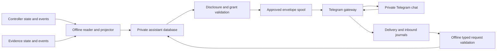

# Telegram messaging implementation plan

**Status: planning only, 2026-09-07.** The operator selected Telegram as Kestrel's
first external messaging channel and explicitly requested no implementation yet.
No code, tests, dependencies, credentials, bot, schedule, or service are created by
this plan. It specializes [MESSAGING.md](MESSAGING.md); the original pilot gates
remain in force. All interfaces, defaults, files, and release criteria below are
proposed, not available commands or passing checks.

## 1. Deliverable and scope

The first useful release is a personal Telegram bot connected to **one operator,
one private chat, and one explicitly scoped lab**. It sends a morning brief,
selected milestones, actionable blockers, and evidence corrections, while retaining
a durable local inbox. It operates without an LLM. A small command vocabulary then
adds acknowledgement, snoozing, and on-demand status.

Build outbound messaging before conversational control. Ordinary research execution
continues under its existing approvals; notification failure never authorizes a
retry, changes an outcome, or stops otherwise authorized work.

### Included in the first release

- Daily brief with a defined coverage interval, freshness, awaiting-you items,
  active work, charged reservations, verified outcomes, and limitations.
- Watches on an individual attempt, a task including retries, a campaign, or an
  explicitly defined project milestone. Routine attempt transitions stay local.
- An awaiting-you queue derived from missing/expired/revoked approval, blocked
  tasks, and exhausted declared budgets; resolution ends its reminders.
- Grouped incidents for uncertain execution/resources and stale/invalid evidence.
- Local inspection of every item, suppression, send attempt, and gap.
- One manually paired Telegram recipient; bounded, restart-safe outbound delivery.
- After outbound verification: `/help`, `/status`, `/brief`, `/inbox`, `/ack`,
  `/snooze`, `/stop`, and `/resume`, each with deterministic semantics.

### Deferred

Free-form model conversation, paper retrieval/summaries, multiple recipients/labs,
groups/channels, email, attachments, interactive buttons, Telegram Mini Apps,
webhooks, remote execution approval, budget expansion, campaign cancellation through
chat, arbitrary artifact download, and automatically starting new experiments.
A project milestone may refer to supported campaign records; richer claim and
replication predicates wait for corresponding runtime evidence producers.

## 2. Product behavior and proposed defaults

| Setting | Starting design | Rationale |
|---|---|---|
| Morning brief | 08:00 in an explicitly configured IANA timezone | Do not infer timezone from whichever host runs the daemon |
| Quiet hours | 22:00–08:00; no automatic overnight bypass | Critical classes can be explicitly enabled during enrollment |
| Other routine schedules | Evening off; weekly memo deferred | Establish whether the daily brief is useful first |
| Projection scan | Every 30 seconds, bounded batch; immediate wake-up is optional | Keeps source integration simple; not a delivery SLA |
| Coalescing | 60 seconds for related ordinary updates | One explanation per incident rather than a task storm |
| Telegram sends | At most one active send and one message per second | Conservative pacing; apply stricter server instructions |
| Daily automated cap | 20 send attempts, including retries; reserve 5 for critical items | A local policy ceiling, unrelated to Telegram's free allowance |
| Requested replies | Separate cap of 20/day and 5/minute; cannot borrow execution budget | Interactive commands must not be suppressed by routine digest traffic |
| Reminder cadence | Once per day for unresolved blockers; at most 2 extra critical reminders/day | No indefinite “until acknowledged” loop |
| Intent expiry | Briefs/critical notices: 24 hours; watched completions: 6 hours; requested replies: 5 minutes | Expired occurrences remain local; a fresh reminder requires a fresh rule evaluation |
| Max notification size | One message, at most 3,000 UTF-16 code units and 16 KiB UTF-8 | Leaves space for identity/freshness; use grapheme-safe clipping |
| Content | Plain text, previews off, no attachments or arbitrary links | Keeps initial rendering/disclosure predictable |
| Stale brief | Current catch-up summary replaces an obsolete pending daily brief | Do not deliver a week of old mornings after reconnecting |

Caps combine into a hard maximum of 40 outbound attempts/day per registered
channel, with all control replies and summaries accounted for. Unauthorized senders
receive no automatic replies. Enrollment has its own one-test-message allowance
under the setup authorization. Reaching a cap queues eligible items until their
expiry or the next allowed window; it never generates an uncapped overflow message.
The local inbox remains available. Adjustments are explicit preferences within the
operator grant, not changes inferred from engagement.

A watched attempt reports its actual execution outcome. A watched task reports
completion after its declared retries and names the attempts. A campaign reports
execution, protocol validity, finding, and assurance separately. Count baseline
recipes, treatment candidates, selections, and attempts separately; do not call
all of them “experiments.” Missing counts or telemetry are unavailable, not zero.

The first project milestone schema is a finite conjunction of predicates over
explicit campaign IDs: terminal state, required protocol status, and optionally
allowed findings/assurance supported by current records. No Python expression,
SQL fragment, arbitrary query, or “queue empty” predicate. Changes create a new
milestone version; invalidation can reopen a previously reached milestone.

Each message identifies the item/revision and observation time. For example:

> C12 completed. Execution succeeded; protocol valid; finding not supported in
> scope; evidence independently recomputed. One treatment candidate plus baseline.
> Item M42, revision 1. Use /status C12 for the permitted summary.

Example copy is synthetic. Each rendered factual field must resolve to a retained
source reference or named deterministic derivation. State “reservations charged”
instead of claiming measured runtime, cash spending, or host-wide GPU utilization.

## 3. Integration with the actual code

Inspected runtime modules are unchanged from `ac9879e`; the messaging proposal was
committed at `651a389`. Separately authored README/guide and specification-relocation
work was committed as `424aa8a` during this review; it is outside this plan's scope.

| Existing location | Required future work | Constraint |
|---|---|---|
| `application.py:Lab.__init__` | Introduce a purpose-built read-only source reader | Opening Lab initializes stores, driver, and agent objects; do not use it in the messaging daemon |
| `application.py:Lab.report` | Extract/share the report's verified interpretation through a read interface | Preserve output semantics and existing tamper/attribution tests; no second weaker report implementation |
| `controller.py` | Bounded source queries; later explicit feed identity/schema migration and service-grant support | Constructor currently writes schema/metadata; no constructor reuse to obtain a read-only handle |
| `artifacts.py` | Read-only bounded evidence/lineage access and invalidation feed | Its constructor creates directories/schema; sources live in a separate DB |
| `contracts.py` | Reuse canonical hashing, bounded parsing and strict internal models | Do not broaden campaign classification or execution capabilities |
| `cli.py` | Add a distinct messaging dispatch branch and proposed commands | Route before the existing generic `with Lab(...)` branch |
| `tests/` | Add messaging tests while retaining existing release tests | External synthetic labs only; sockets disabled after setup |

Introduce modules only with the slice that uses them. Suggested eventual layout:
`reporting.py` for shared verified report logic; `briefings.py` for read models and
rendering; `messaging.py` for assistant state/rules/schedules; `notifications.py`
for envelope/delivery mechanics; `telegram.py` for the transport and later polling.
A small internal module split is preferable to prebuilding plugin packages.

### Read-only source access

Use bounded SQLite reads with existing schema-version validation and no DDL,
write pragmas, migrations, or fixture initialization. Keep readers local to the
source databases; never share SQLite files over a network filesystem. Do not label
an actively written WAL database immutable. Test both live-WAL reads and closed
stores under the intended permissions; read-only OS access can require a deliberate
WAL/shared-memory arrangement. If that cannot be enforced, an authority-owned
reader exports snapshots instead of weakening the boundary.

Share verification of artifact bytes, attribution, outcome-label agreement, and
current validity with `Lab.report`. No source tree imports or raw event-detail
rendering. Capture source cutoffs and relevant evidence revisions; on conflicting
cross-store observations, retry a bounded number of times, then emit a freshness
limitation/integrity item. Never claim a global snapshot transaction.

## 4. Runtime structure and persistence



There are two trust zones: the offline authority side and the Telegram gateway.
The gateway holds one dedicated bot token and sees only approved outbound bytes,
minimal channel policy, and inbound updates. It cannot access raw research DBs,
artifacts, project workspaces, operator tokens, or controller write interfaces.

The gateway can use two supervised loops in one service: one sender and, when
needed, one long poller. They share the same Telegram credential/authority, so
splitting them into separate services would not create meaningful credential
separation. Neither loop blocks the other; journal writes are serialized or use
explicit independent connections and bounded transactions.

Recipient and method restrictions are enforced by the reviewed gateway, not
assumed properties of the bot token. A compromised gateway can misuse its bot
credential; the separation limits exposed research content and protects controller
authority, not the entire Telegram account from that credential holder. A stronger
requirement would need a separately enforced credential/egress boundary and review.

External runtime directories are proposed as separate ownership domains:

- `assistant-private/`: projection state, inbox, preferences, subscriptions,
  source cursors, source references, full local briefings and retention tombstones.
- `notification-export/`: only validated immutable envelopes, short-lived release
  permits, and operator-approved minimal channel configuration.
- `telegram-runtime/`: send attempts, confirmed provider references, inbound journal,
  poll cursors, sanitized diagnostics; gateway-owned and untrusted by the controller.
- `telegram-secrets/`: operator-provisioned credential file, gateway-readable only.

Authoritative notification grants remain operator-issued controller/service policy,
not claims in Markdown, agent output, the delivery journal, or mutable gateway
configuration. Add a versioned service-grant record through the reviewed operator
path; the local development token can exercise synthetic policy tests but cannot
activate real egress. This is a narrow messaging deployment gate, not permission
to deploy arbitrary research execution or enable live model providers.

### Records and transactions

Use a separately migrated assistant DB. Tables initially cover source cursors,
items/revisions, subscriptions, schedule occurrences, briefings, intents, attention
history, and processed request IDs. Keep delivery attempts and inbound update
receipts in the gateway DB. Every mutation has an attributable occurrence and
bounded reason code; no unrestricted user-authored JSON as an executable rule.

For each source batch, atomically commit cursor advancement, projected changes,
and notification intents in the assistant DB. Export is replayable: persist an
intent first, write a bounded temporary envelope, verify/hash it, then atomically
publish under a stable name. Do not open caller-chosen paths or follow symlinks.
A crash before export leaves an intent to export; a crash after export cannot
create another logical notification.

Use separate controller/evidence cursor identities and a vector cutoff on each
brief. Proposed source-feed migrations add durable source IDs; official restore
paths create a new restore epoch. Retain last-consumed event identity/hash and
check head/schema consistency. A clone/restore retaining identical metadata is
not automatically distinguishable; require explicit source rebinding after manual
restoration, and report uncertain continuity instead of inferring identity from
paths or file modification times. Historical backfill populates the inbox but
sends one current summary, not all historical events.

Delivery evidence stays outside scientific evidence exports. Existing source
events may be reused only after checking atomicity and coverage. Add new source
events in their own source transaction if a required condition is otherwise
invisible. Approval expiry and absent heartbeat are clock-derived conditions and
need periodic reconciliation even when no new event arrives.

## 5. Event rules and scheduling algorithm

| Condition | Source/derivation | Behavior |
|---|---|---|
| Approval needed | Current pending work plus matching, unexpired, unrevoked approval scope | One awaiting-you item; clear when authorized or no longer applicable |
| Blocked work | Task state/reason plus independently eligible work | State what can still progress; do not claim total idleness without checking |
| Watched run/campaign | State transition plus watch version and verified report where applicable | One semantic revision; distinguish retry from new independent execution |
| Budget threshold/exhaustion | Frozen limit and charged attempt reservations | Notify each configured threshold once; no dollars or measured consumption invented |
| Uncertain capacity | Attempt uncertainty plus resources held and stop confirmation | Correlate related attempts; never suggest a blind restart |
| Evidence correction | Evidence invalidation feed and message-to-evidence reverse index | Supersede unsent old views; append a linked correction for accepted messages |
| Project milestone | Versioned explicit predicates over recorded campaigns | Notify reached/reopened; never infer an entire project is done |
| Daily briefing | Persisted schedule occurrence and projection cutoffs | One full local record and one short Telegram view |

The rule engine is deterministic. Deduplication keys include scope, condition,
semantic revision, subscription/destination version, and occurrence purpose.
Exclude wall-clock rendering time from semantic revision. Daily briefs include
scheduled local date; intentional reminders have distinct occurrence IDs.

Persist next due UTC instant, IANA timezone, local date, and preference version.
Use the first occurrence of a repeated DST time and the next valid instant for
a skipped time. A restart creates one catch-up occurrence. Source processing,
briefing coverage, transport acceptance, and operator acknowledgement remain
separate cursors. System clock rollback must not repeat a prior occurrence.

Resolve items from source state. An acknowledgement silences that revision's
reminders but cannot resolve a blocker or certify evidence. Snoozing has an explicit
expiry; material worsening creates a fresh revision. Suppression reasons and
queued overflow are inspectable locally. Disable stale export if projection
freshness exceeds its configured bound; a gateway cannot claim the lab is healthy
merely because it can reach Telegram.

## 6. Telegram adapter contract

Use the official hosted Bot API through a small typed HTTPS adapter, initially
with a standard-library HTTP implementation behind an injectable transport seam.
No bot framework, webhook server, or third-party SDK is required for the narrow
method set. If implementation demonstrates a need for a dependency, document it
and pin the tested version. Record the official API documentation revision and
successful integration date; Telegram's hosted service itself cannot be pinned
like a local wheel.

The following external constraints were checked against the
[official Bot API](https://core.telegram.org/bots/api):

| API fact | Implementation consequence |
|---|---|
| `sendMessage` returns a Message on success; text is limited to 4,096 characters | Store the returned chat/message identity; use the stricter local text cap |
| `getUpdates` and webhooks are mutually exclusive | Use polling; inspect existing webhook state before enrollment |
| Advancing the polling offset confirms earlier updates | Persist received updates before advancing the offset |
| Updates are retained at most 24 hours | Report possible inbound loss after extended outage |
| Update IDs can reset randomly after a week without new updates | Do not treat IDs as a permanent global monotonic sequence |
| Flood-control responses can contain `retry_after` | Respect the server's minimum retry delay |

Ordinary bot messaging is free within Telegram's limits, including approximately
one message per second per chat. Leave paid broadcasts disabled and never expose
paid sending options through the adapter. [Official FAQ](https://core.telegram.org/bots/faq)

The initial outbound methods are `getMe`, `getWebhookInfo`, and `sendMessage`;
`getUpdates` is used for enrollment and later commands. No arbitrary method name,
URL, token, recipient, or request body can come from a worker or assistant item.
The fixed remote origin is `api.telegram.org`, HTTPS only, no redirects, no implicit
environment proxy, no file downloads, and no custom local Bot API endpoint in v1.
Test DNS/egress enforcement on the deployed host; Python URL checks alone do not
contain a compromised gateway.

A bot token is embedded in Telegram's request URL. Construct it only inside the
adapter and suppress full URLs, request bodies, exceptions, HTTP debug traces,
and credential material from logs. Log a method name, opaque channel ID, local
attempt ID, status category, and bounded timing instead. Never place the token
in a command-line argument or ask the user to paste it into a conversation.
[Official bot setup tutorial](https://core.telegram.org/bots/tutorial)

Require TLS verification, connection/read/total deadlines, bounded response/header
sizes, duplicate-key rejection, and explicit JSON field types. Start with a
256 KiB outbound response cap, 1 MiB poll response cap, and a 10-second total send
deadline. These are proposed local limits to test, not provider guarantees.
Map only recognized response fields into strict internal DTOs. Ignore additive
irrelevant external fields after bounded parsing; reject unknown critical shapes.
Verify recipient identity in a successful response before recording acceptance.

Render one plain-text summary; a long result stays in the local inbox, with an
opaque item ID and a supported status command. No raw links from project titles,
no shell commands, no partial truncation that loses outcome/assurance caveats.
Compute the whole message budget before release. A correction is a new message
referencing the old item, not an edit that erases the historical notification.

## 7. Enrollment, credentials, and revocation

Future enrollment is operator-driven and explicitly authorized, with synthetic
content used for the first live test:

1. Create a dedicated bot through BotFather, restrict its intended use to this
   personal assistant, and place its token in the protected external credential
   file. This is future operator work, not part of drafting this plan.
2. Validate the bot identity and existing webhook state. If another integration
   owns the bot, stop with a clear conflict; never delete its webhook or discard
   pending updates automatically.
3. Generate a 128-bit one-time pairing nonce locally, store only its hash, and
   expire it after ten minutes. Use a private-chat start link carrying the nonce.
   Telegram documents this deep-link mechanism and its bounded parameter format.
   [Official deep-link documentation](https://core.telegram.org/bots/features#deep-linking)
4. Poll only for the pairing event. Require private chat, a non-bot sender, matching
   unconsumed nonce, and a current pairing session. Record numeric bot/user/chat IDs.
   Username/display name is descriptive only. Other inbound content produces no
   research response; minimize retention of rejected third-party content.
5. Show the candidate identity through the trusted local operator path. Local
   confirmation binds that identity, lab/project scope, timezone, disclosure,
   limits, and expiry into the notification grant. Do not adopt the first person
   who happens to message the bot. The nonce alone does not approve research.
6. Send one authorized synthetic test message. Separately record API acceptance
   and the operator's manual observation on the intended device. A human sighting
   is integration evidence, not a new universal delivery guarantee.

Use a dedicated bot per lab in v1 so another installation cannot consume its
updates. Local locks prevent accidental duplicate daemons; detected polling
conflicts require operator reconciliation. A copied token on another host remains
a residual risk, addressed by rotation and an explicit ownership record.

At export and before every send, validate grant/channel versions, scope, expiry,
revocation, destination identity, and content digest. Propose release permits with
a maximum lifetime of 60 seconds; gateway policy refresh every 5 seconds, failing
closed on unavailable/stale policy. Declare up to 60 seconds for revocation to
propagate to unsent released envelopes, plus the bounded in-flight send race.
An accepted message cannot be reliably recalled. Short permits are refreshed
from the still-valid intent; they do not force source events to be regenerated.

Credential rotation pauses sends/polling, confirms the new credential identifies
the same intended bot or requires re-enrollment, and reconciles ambiguous attempts
before resuming. `/stop` can pause messaging; it cannot revoke the bot token at
Telegram. Emergency local disable/revocation must work even when Telegram is down.

A service grant may permit awaiting-approval messages independently of campaign
execution approval. It never confers `execute`, `live_provider`, `network` on a
worker, or permission to disclose another project. First live integration is
public-synthetic only. Restricted records in adversarial tests remain synthetic;
identifiers/hashes/generic pointers do not bypass disclosure policy.

## 8. Crash recovery and delivery policy

Use the logical delivery and attempt separation from MESSAGING.md. Start with
`PENDING`, `READY`, `SENDING`, `ACCEPTED`, `RETRY_WAIT`, `UNCERTAIN`, and explicit
terminal suppression/expiry/revocation/failure states. Commit `SENDING` before
calling the provider. Keep a unique logical intent per semantic revision and
append attempts rather than overwriting the last failure.

| Observed result | Planned handling |
|---|---|
| Valid accepted response matching destination | Persist provider reference and acceptance time; no inference of reading |
| Valid flood-control rejection | Persist retry deadline; count the attempt and obey expiry/caps |
| Definitive credential, recipient, or payload rejection | Disable affected channel or fail the envelope as appropriate; local diagnostic |
| Failure conclusively before request transmission | Bounded retry with jitter and grant recheck |
| Timeout/reset after transmission, malformed success, server failure with uncertain side effect, or crash in SENDING | UNCERTAIN; no blind automatic resend |
| Pending item resolved, superseded, or revoked | Suppress before send and retain reason |

Allow at most three transmission attempts per occurrence. For eligible retries,
start with a 5-second exponential backoff capped at 60 seconds plus bounded jitter;
server delays take precedence. If the next eligible time exceeds the intent's
expiry, expire it. Refreshing a short-lived release permit never resets intent
age, retry count, or channel quotas.

The first adapter will not assume provider-side idempotency or a history lookup
that can prove an ambiguous send. Record the operational limitation explicitly.
Uncertainty does not freeze the whole queue: independent fresh items may proceed,
while a stale success from the same item cannot leapfrog its correction. A later
scheduled reminder/brief may describe the still-open condition with a distinct
occurrence; it is not replay of the ambiguous original.

Use only one active sender. A local lease cannot fence a paused HTTP request at
Telegram. On takeover, retain in-flight uncertainty until the old sender is known
to have stopped; never equate lease expiry with safe resend. Enforce timeouts and
process termination locally and test delayed-response/takeover races.

After outage, reconcile source state before releasing backlog, recheck permission,
supersede obsolete views, and produce one bounded catch-up brief. Measure separate
projection lag, send backlog, last acceptance, and inbound polling health. A dead
host cannot notify through its own bot; an independent watchdog is optional future
work, with its own authorization and failure domain.

## 9. Limited replies and inbound reliability

This is the final slice of the first release. No model is needed to interpret
these commands; unsupported prose gets a bounded help response only from the
registered operator and within the reply budget.

| Command | Authorized effect |
|---|---|
| `/help` | Lists enabled commands and scope |
| `/status [campaign-id]` | Returns a newly validated permitted summary; unknown IDs reveal no cross-project information |
| `/brief` | Requests a current briefing without changing scheduled briefing coverage |
| `/inbox` | Returns the top unresolved permitted items with opaque IDs |
| `/ack item-ref` | Acknowledges the exact referenced attention revision; does not resolve source state |
| `/snooze item-ref 1h` or `tomorrow` | Defers that revision's reminder to a defined time; tomorrow means next 08:00 in configured timezone |
| `/stop` | Durably pauses automated Telegram delivery, including reminders |
| `/resume` | Resumes within the still-valid existing grant; cannot restore revoked authority or broaden scope |

No approve/run/cancel/budget/policy commands. Watch/schedule changes remain local
operator CLI operations initially. Rich question answers are a later N4 extension:
revision-bound assumption proposals, never edits to frozen contracts.

For replay safety, the displayed opaque item reference binds both the stable item
and its exact revision (for example, `M42-r1`). Use that expected revision in the
resolved internal command; if a reference is stale or ambiguous, ask the operator to
refresh the inbox rather than acknowledging newly worsened evidence. Stop/resume
are idempotent preference operations, with idempotency tied to the inbound event.

Use one long poller with a proposed 25-second poll timeout and 35-second total
HTTP deadline. Limit requested update types to ordinary messages and still validate
actual types; no business, group, channel, edited, forwarded, or bot-sender input.
Bind every accepted command to both registered user and private chat IDs. Apply a
15-minute freshness limit to attention mutations; stale commands cannot silently
change current preferences. A fresh status request can retrieve current state.

Persist a bounded normalized update or a rejection tombstone before acknowledging
it upstream. Key dedupe by bot/enrollment identity and update ID, retaining message
identity/date as a collision/replay check. Commit validated attention changes and
response intents atomically with processed request IDs on the offline side.
Restart between journal, processing, and response delivery must neither lose a
committed command nor apply it twice. External response loss remains uncertain.

Do not infer a missing update merely from a numeric gap: filtering and Telegram's
idle reset make that unsafe. After prolonged inactivity near the documented reset
interval, enter an explicit cursor-rebase mode: poll without the old high offset,
compare against retained event identities, then persist a new epoch/cursor from
the observed batch. Test idle resets, duplicate batches, and bot re-enrollment.
Never use negative offsets or destructive queue dropping as routine recovery.

If offline beyond Telegram's retention window, report possible lost replies and
ask for unresolved answers again; never assume the operator did not answer.
Full/unparseable oversized inbound storage pauses offset advancement and reports
a local gap/blocker; do not acknowledge bytes that were not durably accounted for.
Polling with replies disabled may discard non-pairing events only with an explicit
recorded policy; it cannot silently pretend those replies were processed.

The gateway's inbound journal is untrusted. Its compromise can affect attention
and forge transport-level acknowledgements within delegated limits; it cannot
obtain scientific review status or research execution authority. Do not label bot
account identity as an independent high-assurance operator credential.

## 10. Implementation slices and review gates

Each slice produces working behavior plus its relevant tests. The user has
requested only this plan; none of the following work starts in this task.

| Slice | Concrete work | Exit gate |
|---|---|---|
| T0 / N0 | Read-only readers, shared verified report interpretation, deterministic local brief command | No source mutation; exact report semantics preserved; negative, pending, corrupt, and unavailable evidence cases |
| T1 / N1 | Assistant DB migrations, projection, event rules, watches, explicit milestones, daily schedule, local inbox/outbox | Restart/dedupe/multi-source/DST tests; current baseline backfill; original pilot unaffected |
| T2 / N2 | Approved-envelope spool, fake dispatcher, send state machine, service-grant policy model, local lifecycle commands | Crash-at-every-boundary, cap, expiry/revocation, malformed envelope and no-egress tests |
| T3 / N3 development | Minimal Telegram HTTPS adapter plus one-time pairing workflow using fake HTTP | Exact request/response shapes; recipient/token/log protections; no sockets in routine tests |
| T4 / N3 activation | Separate-identity deployment profile and one explicitly authorized synthetic live integration | Actual read/write/egress denials, credential boundary, device observation, reviewed grant and pinned tested client assumptions |
| T5 / N4 subset | Durable poller and typed status/attention commands | Replay, stale/spoofed/foreign/oversized input and idle reset tests; no execution authority reachable |

T0 → T1 → T2 → T3 is the implementation order. T4 gates real delivery. T5 can be
implemented offline after T3 and activated only through the corresponding reviewed
inbound grant. The useful outbound release is T0–T4; the conversational first
release adds T5. Neither requires N5 remote approval, N6 literature, live model
integration, a GPU, or completion of general project execution.

Proposed CLI surface, to validate as UX during implementation:

```text
kestrel --lab LAB brief --since TIMESTAMP --format markdown|json
kestrel --lab LAB inbox list|show
kestrel --lab LAB notify watch|unwatch
kestrel --lab LAB notify milestone add|inspect
kestrel --lab LAB notify schedule show|set
kestrel --lab LAB notify reconcile --once
kestrel --lab LAB notify telegram pair|inspect
kestrel --lab LAB notify delivery list|inspect
kestrel --lab LAB notify pause|resume|revoke
```

Service processes use a separate externally provisioned messaging configuration,
not `Lab` initialization or a bot token argument. Local control commands must
explain whether they only change attention, require an operator grant, or perform
a network test. Preview and dry-run modes never call Telegram. Unknown commands
or missing authority fail closed; no “development” switch bypasses live gates.

## 11. Verification and rollout evidence

Create `tests/test_briefings.py`, `tests/test_messaging.py`, and
`tests/test_telegram.py` as their slices land, adding stateful tests where recovery
and interleavings warrant them. Existing application/controller/artifact tests
remain authoritative regressions. Keep new messaging acceptance IDs separate
from the pinned original acceptance inventory.

| Test group | Concrete counterexamples | Proposal coverage |
|---|---|---|
| Evidence/read-only | Tampered result, wrong campaign attribution, invalidation during projection, unavailable source, hidden constructor writes | N-A03, 09, 10, 14, 19 |
| Projection/schedules | Duplicate batch, empty interval, source restore, DST fold/gap, missed days, expiry with no new event, false project completion | N-A08, 13, 17, 18 |
| Delivery | Lost response, crash before/after send, stale sender, 429, credential rejection, over-cap retry, obsolete success, token rotation | N-A04, 08, 11, 15, 16 |
| Disclosure | Secret/absolute path, hostile Unicode/markup, restricted metadata, foreign recipient, redirect/proxy injection, spool symlink | N-A01, 02, 06, 12 |
| Inbound | Wrong user/chat, replay, edited/forwarded message, stale acknowledgement, stop/resume race, idle ID reset, 24-hour gap, full journal | N-A07, 11, 17, 18, 19 |
| Actual deployment | Gateway DB read/write attempts, worker credential access, forbidden egress, source/spool exhaustion and process stop enforcement | N-A05, 12, 15, 16, 18 |

N-A20 literature tests are deferred with N6, explicitly unrun. Existing platform,
provider, and GPU blockers are reported individually; passing notification tests
does not clear unrelated release gates. Original Linux isolation requirements
still apply to unattended research deployment.

Keep standard tests network-free using the existing socket prohibition and fake
HTTP responses. Generate all labs/repos under external temporary directories.
Use deterministic clocks and failure injection for routine recovery tests. Do not
repeatedly contact Telegram to test flood limits, identity attacks, or failures.
A separately invoked live test uses only an authorized bot/chat, a bounded message
allowance, and public synthetic content; no token enters JUnit or captured fixtures.

Enforce the existing fixture resource envelope as a maximum for application-owned
tests. Set messaging test batch/retention budgets inside it; test actual bounds,
not only configured numbers. Proposed first deployment targets are a 64 MiB total
messaging spool/journal budget and no more than 128 MiB per messaging process,
subject to measured runtime capability. These are targets, not verified limits or
a statement about total host footprint. SQLite WALs, journals, logs, temporary
files, and tombstones count against storage. Queue saturation keeps unresolved
items and compact identity tombstones where possible, pauses intake/export safely,
and reports any retention gap. Retention duration never overrides a hard byte cap.

At implementation time run relevant static, unit/integration/state-machine,
adversarial and package-install checks, plus target-OS isolation tests where the
boundary is claimed. Record source revision, commands, exits/skips, JUnit, fixture
and package hashes, migration results, sanitized wire evidence, and residual
limitations. Build a migration/rollback fixture before changing source schemas;
never roll back by deleting research state.

Rollout sequence: offline preview → fake end-to-end replay → measured principal
separation → authorized synthetic Telegram canary → limited daily briefing/watch
use → separately enabled inbound commands. Local pause is the immediate rollback;
operator revocation/token rotation stops future authorized sends, preserving
inbox and ambiguous-attempt history. Host service installation/deployment requires
its own explicit operator authorization and independent review.

## 12. Decisions settled and inputs still needed

Settled for planning: Telegram first; one private recipient; one lab; plain-text
outbound; deterministic briefs; durable local inbox; polling rather than a public
webhook; limited typed replies after outbound verification; no remote execution
approval or model requirement. Use the broader proposal's disclosure/authority
rules, with the concrete Telegram constraints and sequence in this plan.

Before activation, collect timezone/cadence, selected projects/watches, disclosure
profile, bot/chat identity, grant lifetime, critical quiet-hour exceptions, external
state location, and deployment host/OS identity. These do not block T0–T3 offline
implementation once implementation is requested. No token or account information
is needed to review this plan.

**Exact next action after authorization to implement:** start T0 by extracting the
verified report interpretation behind read-only source interfaces, preserve existing
report outputs/tests, and deliver `brief` against generated external synthetic labs.
Do not create a bot, connect a user project, or install a daemon as that first step.
